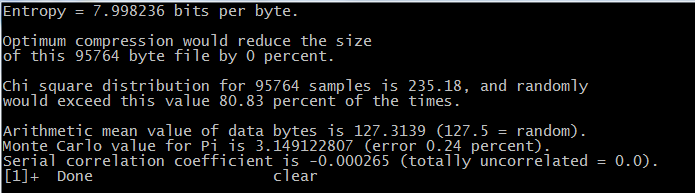

# BlueRand
Java True Random Number Generator (TRNG) that uses JPEG images as entropy source.

##How it works
* It uses two different input images (with the same resolution). These images are considered independent because captured in two different moments. 
* It use the [Mixing technique](https://tools.ietf.org/html/rfc4086#section-5), so the output will be unpredictable if at least one  image is unpredictable.
* Only some of the total amount of pixels are considered. The CSPRNG [SecureRandom](https://docs.oracle.com/javase/7/docs/api/java/security/SecureRandom.html) sets for each considered pixel how many consecutive pixels have to be discarded. In this manner the correlation between consecutive pixels is avoided. This also guarantees that if the generator is run twice two different outputs are generated.
* Only the BLUE channel is considered. So the correlation between different RGB channels is avoided.
* The noise that can be found in images is located in the least significant bits ([LSB](https://en.wikipedia.org/wiki/Least_significant_bit)). For this reason only the LSB of each input byte is considered. You can also choose to consider the second least significant bit.

## Sample
Simplest use:
```java
BlueRand random = new BlueRand("sample/input/a.jpg", "sample/input/b.jpg");
try {
	ArrayList<Byte> output = random.generateRandom();
} catch(BlueRandException e){
	e.printStackTrace();
}
```
Please check [here](sample/Sample.java) for more samples.

##Customize options
```java
BlueRand random = new BlueRand();
random.random.setInputImages("sample/input/a.jpg", "sample/input/b.jpg");
random.considerTwoLSB(true);
random.setOutputFile("sample/output/ab.txt");
random.setOutputImage("sample/output/ab.bmp");
random.overwriteOutputFile(true);
random.deleteInputFiles(true);
```

##Tests
An [ENT](http://www.fourmilab.ch/random/) test result:



The random bytes as image:


## License
BlueRand is licensed under [Apache License 2.0](http://www.apache.org/licenses/LICENSE-2.0) license.
